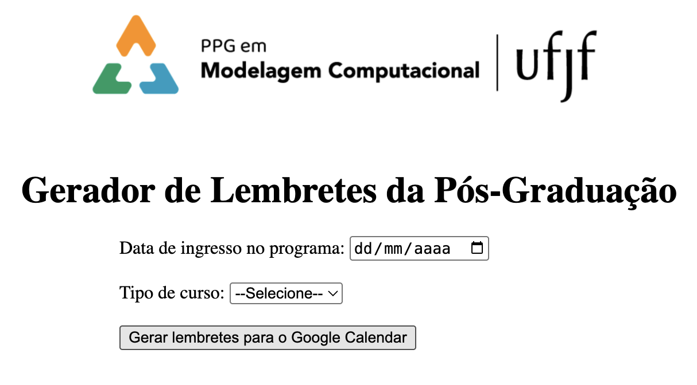

# PPG Notification

Sistema que gera um arquivo .ics contendo lembretes para todos os prazos de mestrado ou doutorado do Programa de Pos-Graduaçao em Modelagem Computacional da UFJF (PPGMC/UFJF).

## Requisitos

```
pip install flask ics
```

```
python app.py
```

abra no navegador:

```
http://127.0.0.1:5000
```




1 - Escolha a data de ingresso;

2 - Escolha o curso (mestrado ou doutorado);

3 - Clique em gerar lembretes;

4 - Abra o arquivo .ics gerado escolhendo qual calendario vai adicionar.